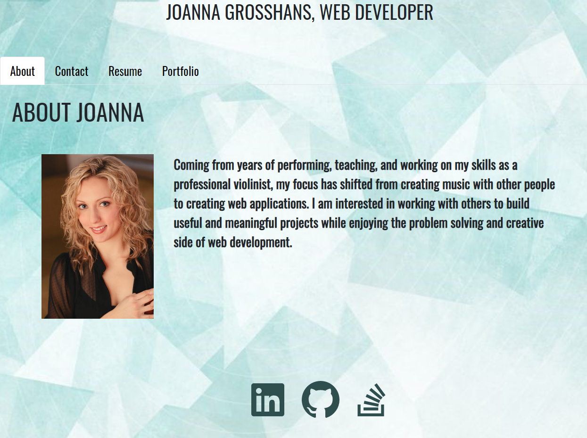

# React-Portfolio

## Description

This portfolio is for Joanna Grosshans. The purpose of this application is to display portfolio projects, and contact information for Joanna to future employers and colleagues. There is also an "About" section which gives background information. In addition, there is a link to download her resume, and a list of learned technologies. There are links to her Github, LinkedIn, and Stackoverflow pages.

## Images 
  

## Installation
    React-create-app, reactstrap
## Usage
    For personal use.
## License
    none
## Contributors
    Joanna Grosshans, creator
## Tests
   none
## Questions
jgrossh2  
[GitHub](https://github.com/jgrossh2/react-portfolio)  
[GH-pages](https://jgrossh2.github.io/react-portfolio/)  
Please contact <joannagrosshans2@gmail.com> for additional Information.

# Technologies used
 * JS  
 * React 
